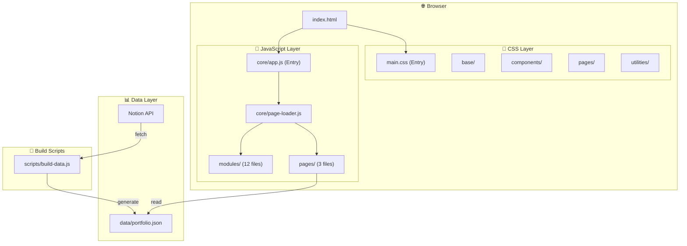

# 아키텍처 문서

> 오유택 포트폴리오 웹사이트의 기술 아키텍처 문서

---

## 개요

이 프로젝트는 **Clean Architecture** 원칙을 따르는 Vanilla JavaScript SPA(Single Page Application)입니다.  
프레임워크 없이 순수 HTML, CSS, JavaScript로 구현되어 있습니다.

---

## 아키텍처 다이어그램



---

## 레이어 구조

### 1. CSS 레이어

```
css/
├── main.css              # 진입점 (모든 CSS import)
├── base/
│   ├── variables.css     # CSS 변수 (색상, 폰트, 간격, 애니메이션)
│   └── reset.css         # 브라우저 초기화
├── components/
│   ├── buttons.css       # 버튼 스타일
│   ├── cosmic-bg.css     # 우주 배경 효과
│   ├── cursor.css        # 커스텀 커서
│   ├── intro-loader.css  # 로딩 화면
│   └── navigation.css    # 네비게이션
├── layout/
│   └── transitions.css   # 페이지 전환
├── pages/
│   ├── branches.css      # Branches 페이지
│   ├── stem.css          # Stem 페이지
│   └── roots.css         # Roots 페이지
└── utilities/
    ├── animations.css         # 기본 애니메이션
    ├── premium-animations.css # 고급 애니메이션
    └── responsive.css         # 반응형 중단점
```

**Import 순서가 중요합니다:**
1. Base (변수, 리셋)
2. Layout (전환)
3. Components (UI 요소)
4. Pages (페이지별)
5. Utilities (오버라이드)

---

### 2. JavaScript 레이어

```
js/
├── core/
│   ├── app.js            # 앱 부트스트랩 (진입점)
│   └── page-loader.js    # 페이지 모듈 로더
├── modules/
│   ├── beliefs-renderer.js    # 나의 신념 렌더러
│   ├── canvas-interaction.js  # Roots 줌/팬
│   ├── career-slider.js       # 경력 슬라이더
│   ├── cursor.js              # 커스텀 커서
│   ├── data-preloader.js      # 백그라운드 데이터 로딩
│   ├── horizontal-scroll.js   # 가로 스크롤
│   ├── intro.js               # 인트로 로더
│   ├── mindmap-layout.js      # 마인드맵 레이아웃
│   ├── modal-renderer.js      # 모달 렌더러 (갤러리, 토스트)
│   ├── navigation.js          # 네비게이션
│   ├── page-transitions.js    # 페이지 전환
│   ├── roots-data.js          # Roots 데이터
│   ├── roots-structure.js     # Roots 구조
│   ├── rotating-text.js       # 회전 텍스트
│   └── star-field.js          # 별 필드 캔버스
└── pages/
    ├── branches.page.js   # Branches 페이지 로직
    ├── stem.page.js       # Stem 페이지 로직
    └── roots.page.js      # Roots 페이지 로직
```

**모듈 초기화 순서:**

```javascript
// 1. Global Modules (한 번만 실행)
initIntro();
initCursor();
initStarField();
initPageTransitions();
initNavigation();

// 2. Page-Specific Modules (페이지별)
initializeAllPages();
```

---

### 3. 데이터 레이어

```
data/
└── portfolio.json    # 포트폴리오 데이터

scripts/
└── build-data.js     # Notion → JSON 변환
```

**데이터 흐름:**

```
Notion Database
      ↓
build-data.js (fetch + download images)
      ↓
data/portfolio.json
      ↓
roots.page.js (render mindmap)
```

---

## 핵심 설계 결정

### 1. 프레임워크 미사용

**이유:**
- 빠른 초기 로딩
- 외부 의존성 최소화
- 완전한 제어권

### 2. ES Modules

```javascript
// ✅ 사용
import { initIntro } from '../modules/intro.js';

// ❌ 미사용
<script src="main.js"></script>
```

### 3. CSS 변수 기반 디자인

```css
/* 유동적 타이포그래피 */
--text-lg: clamp(1.125rem, 1rem + 0.625vw, 1.25rem);

/* Apple 스타일 이징 */
--ease-expo: cubic-bezier(0.16, 1, 0.3, 1);
```

### 4. Mobile-First 반응형

```css
/* 기본 = 모바일 */
.component { ... }

/* 점진적 향상 */
@media (min-width: 768px) { ... }
@media (min-width: 1024px) { ... }
```

---

## 페이지별 아키텍처

### Branches (가지)
- **레이아웃**: 가로 스크롤
- **핵심 모듈**: `horizontal-scroll.js`
- **데이터**: 정적 HTML

### Stem (줄기)
- **레이아웃**: 수직 스크롤 (4개 섹션)
- **핵심 모듈**: `rotating-text.js`, `career-slider.js`
- **데이터**: 정적 HTML

### Roots (뿌리)
- **레이아웃**: 자유 캔버스 (줌/팬)
- **핵심 모듈**: `canvas-interaction.js`, `roots.page.js`
- **데이터**: `portfolio.json`에서 동적 로드

---

## 성능 최적화

### 1. 이미지
- 로컬 저장 (Notion URL 만료 방지)
- 지연 로딩 고려

### 2. CSS
- `@import`로 HTTP/2 병렬 로드
- 사용하지 않는 스타일 정리

### 3. JavaScript
- ES Modules로 코드 분할
- 이벤트 위임 사용

---

## 보안

- API 키는 `.env` 파일에 저장
- `.gitignore`에 `.env` 추가
- 클라이언트에 API 키 노출 없음

---

## 확장 가이드

### 새 페이지 추가

1. `css/pages/new-page.css` 생성
2. `js/pages/new-page.page.js` 생성
3. `index.html`에 페이지 마크업 추가
4. `css/main.css`에 import 추가
5. `js/core/page-loader.js`에 등록

### 새 모듈 추가

1. `js/modules/new-module.js` 생성
2. `export function initNewModule() { ... }`
3. `js/core/app.js`에서 import 및 호출

---

## 유지보수

### 데이터 업데이트

```bash
npm run build-data
```

### 개발 서버

```bash
npm run dev
```

### 프로덕션 배포

정적 파일이므로 모든 호스팅 서비스에서 배포 가능:
- GitHub Pages
- Netlify
- Vercel
- AWS S3
